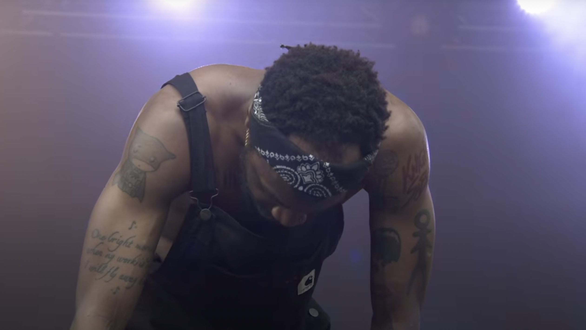
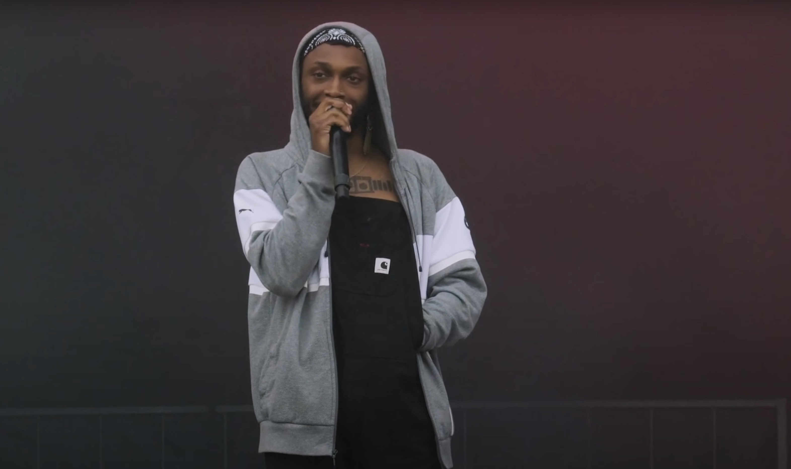

His entrance demonstrates everything you need to know about him. To a packed standing room audience at the Pitchfork Music Festival in 2019, he emerges alone from backstage looking more like an introverted Google software engineer than a world-renowned rapper, hoodie up and backpack in tow. As the audience thunderously chants his name - *Peggy! Peggy! Peggy! Peggy!* - he’s hunched over behind a DJ’s table, typing his password into his laptop keyboard and pulling up an Ableton session. Now sauntering out from behind the audio gear, we get a better look at his gait; the tech-worker aesthetic gives way to that of a boxer entering the ring for a championship bout. Finally breaking the tension, he gives himself an introduction: “My name is JPEG-motherfucking-MAFIA, and I put on my good corduroys just for y’all.” One more trip back to the computer to start the beat, and he’s off; his first bar is delivered as a scream while he sprints across the stage.

This is exactly who JPEGMAFIA is: a restless tinkerer who can’t be tied down to one particular sound or aesthetic. He’s just as comfortable rapping with a hypermodern, triplety screamo-influenced flow over glitchy distorted beats as he is vibing on samples stitched together from the 1970s. His music deals in raw, unbridled energy, and his performance practices mirror his love for sonic chaos. He screams until his voice is raw, delivers bars while gyrating on the ground, and jumps fearlessly into the audience to crowdsurf, yet somehow has the stamina to constantly run around the stage all the while. In the moments where he must briefly stop to catch his breath, he scales back the pandemonium to reveal a sly, deadpan sense of humor. While cheeky, his comment about “putting on [his] good corduroys” for the crowd aptly summarizes his musical philosophy: he's experimental and willing to take creative risks, but packages these risks in such a way that they never obscure the energy that his music aims to convey. At the risk of oversimplifying the breadth of his music, I’ll analyze JPEGMAFIA’s performance within the context of three basic categories, or *vibes* he taps into: screamo-trap, glitchy electronica, and throwback beats.

---

## Part 1: Screamo-Trap

JPEGMAFIA’s affinity for music with an aggressive, distorted tilt is clearly on display with his first song of the concert, a Denzel Curry track entitled “VENGEANCE.” “VENGEANCE” is designed to punch you directly in the mouth; it’s a medium-tempo trap beat driven by distorted, deep 808 bass tones contrasted with a smooth, sine-wave ostinato in the higher register sounding out a tritone to create harmonic tension. Lyrically, it’s consistent with other “internet rap” songs in that it focuses on the macabre with allusions to violence, revenge, and gore, making frequent allusions to popular 2000s TV shows and cartoons. As in the original recording of the track, Curry’s verse comes first, and Peggy allows its first half to play uninterrupted. On the line “Cause I go hard like Timmy!” (likely a reference to the South Park character), he joins in, doubling Curry at a scream to create a multilayered textural effect. In a live setting, JPEGMAFIA relies on his “screamo” voice much more than he does in the studio, likely because it ramps up the energy of the performance and gets the crowd more involved.

Another tactic that allows Peggy to so successfully pull off the screamo-trap aesthetic is his own body. One instant he’ll have a calm, collected demeanor, but in the blink of an eye he’ll snap his upper body and neck to become a man possessed, only to return to his resting state just as quickly as he left it. While many rappers might gesticulate with their hands, or lightly bounce their knees at the end of phrases while they perform, JPEGMAFIA here takes this practice to its logical extreme, utilizing the full range of motion of his hips, knees, and torso to visually mark his flows. These wild, exaggerated movements also allow him to showcase his fatigue for dramatic effect; as he occasionally bends over, crawls on the ground, or gasps for air in the middle of a phrase, it’s impossible to question his dedication to his craft.

Approximately halfway through the concert we’re treated to “Panic Emoji,” another screamo-trap track which sees Peggy once again employ distorted 808s vocals to encourage the audience to dance. “KEEP HUSTLING. KEEP MOVING,” he yells after motioning the audience to make space for him to jump into the fray - the tempo is slow enough that the most enthusiastic crowd-members can time their jumps to the beat. At first he violently pinballs off of various spectators, but eventually they close in around him and he’s lost in a sea of heads bobbing up and down in a moment of collective aggressive catharsis.

## Part 2: Glitchy Electronica

While he’s certainly effective within the confines of the screamo-trap aesthetic, JPEGMAFIA is most at home when harnessing unmitigated sonic bedlam to challenge his listeners. Bantering with the crowd to introduce the third song of the concert, called “Thug Tears,” he flashes his wittily self-deprecating side: “Look. I’ve got a lotta disappointing shit coming for y’all. I can’t play any of it.” By using the term “disappointing”, Peggy is referring to his well-documented love for uncomfortable music and unsettling textures that are unpleasant to the ear. “Thug Tears” certainly falls into this category, possibly heightened by the fact that listening at home, we have direct access to the stereo mix coming from his laptop in a way that audience members wouldn’t be able to hear. The production begins with a rapid-fire clicking noise I can only describe as dozens of crickets burrowed into my inner ears - through clever usage of side-chain compression with the kick drums that enter soon after and dizzying panning in the headphone mix, this is grating even to the most battle-hardened of listeners.

Soon, though, we’re spared from the clicks, which give way to a relatively sparse instrumental driven by high-register, bubbly synth sounds. The juxtaposition of these more flowery sound palettes and space with JPEGMAFIA’s intense vocal screeches creates a sense of anticipation which, paradoxically, makes the beat hit just that much harder. And in these moments of relative quiet, the at-home listener can most easily appreciate the extent to which the audience knows and appreciates Peggy’s music. Unprompted, they audibly engage in call-and-response that exists on the record but not the live instrumental, completing the line “Watch how I finesse” with “(‘Bout a hundred bands).” Even when it borders on physically painful to listen to, JPEGMAFIA’s music finds a way to resonate with the crowd.

The glitchy electronica aesthetic need not always be sparse and grating, however. Take “I Cannot Fucking Wait Until Morrissey Dies,” which, despite the title, delivers some of the most tender (by comparison) moments of the entire concert. Sparkly synths take the lead once again, but this time the distortion in the bass is dialed back a tad - we can clearly hear the pitches and harmonic structure of the song. Peggy still partakes in his fair share of screaming on this track, but showcases the lower volumes of his vocal range as well, dialing back the energy. The consonant chords, textures, and standard eighth-note flow of bars switch the audience temporarily from banging to bobbing their heads, a necessary change of pace to recharge their necks for more violence to come.

## Part 3: Throwback Beats with a Twist

As if to stamp his place within the continuum of great hip-hop artists, JPEGMAFIA’s tracks occasionally drift out of internet/meme/glitch-land into a style more directly connected to the historical giants of the genre, as do his flows. The midpoint of the show features a crowd-favorite called “How to Build a Relationship,” in which Peggy demonstrates his lyrical virtuosity within a more traditional context without losing sight of his own uniqueness. Whereas his raps on more experimental tracks are generally rhythmically abstract and fragmented, here he stacks long, dense phrases together without skipping a beat: “I could never show all you n\*\*\*\*\*s all this dirt I’m doin’ / Sticks to your face like hacksaw, Jim Duggan / First n\*\*\*\* put you on the ropes, had you lookin’ like a ghost / ‘Cause you in my heart but you not movin.’” The production also sonically sounds out the ‘90s more than other tracks; the hi-hats sound like they could be acoustic, and the compressor on the kicks is rolled back, allowing them to breathe and resonate. Still, glitches and beat switches make infrequent appearances to firmly establish this as JPEGMAFIA's work.

“Macaulay Culkin,” the concert’s penultimate track, follows a similar blueprint of utilizing long, rhythmically simple phrases paired with more old-school elements. Forty minutes into the performance, it stands out as the first and only song to both be based off of a chord progression rather than a textural sample or drum beat, and to completely forego the use of distortion. And instead of his normal off-the-wall stage antics, Peggy simply takes a seat on the barrier between him and the audience and delivers his verses. These throwback-style tracks aren’t necessarily his bread and butter per se, but nonetheless highlight his versatility and attention to set-list construction in order to craft a coherent arc to the show.

## Part 4: "This song was produced by a police officer"

A sea of white hands precariously floats him over the top of the crowd. “I’m a real n\*\*\*\*” is the chant - through headphones we can barely hear the suggestion of audience participation in this mantra, which begs the question: are white people joining in? To this day, Chicago is one of the most *diverse* yet *segregated* cities in America, an ugly relic of [discriminatory housing and economic policies](https://www.theatlantic.com/business/archive/2018/03/chicago-segregation-poverty/556649/)  that have, and continue to, present barriers to upward socioeconomic mobility for poorer Black families. The Pitchfork Music Festival and other events of its kind serve as beacons for this reality, with sky-high ticket prices (in the $150-$300 range) reflecting the trend of gentrification.

JPEGMAFIA himself is certainly aware of this dynamic, as are YouTube commentors. One reads, "JPEGMAFIA screaming the n-word into a crowd of white people is epic." Another notes, "God damn this audience is like a snow storm." While he's not looking to make a confrontational political statement on the spot, Peggy addresses this dynamic by taking light comedic jabs at whiteness reminiscent of an early-career Eminem. For example, in the introduction to "How to Build a Relationship," a collaboration with white electronic artist Flume, he jests, "I just gotta warn y'all... This next song is also produced with a Caucasian man. I'm just warning everybody, ok? I like to keep shit fair and balanced, like Fox News, you feel me?"
